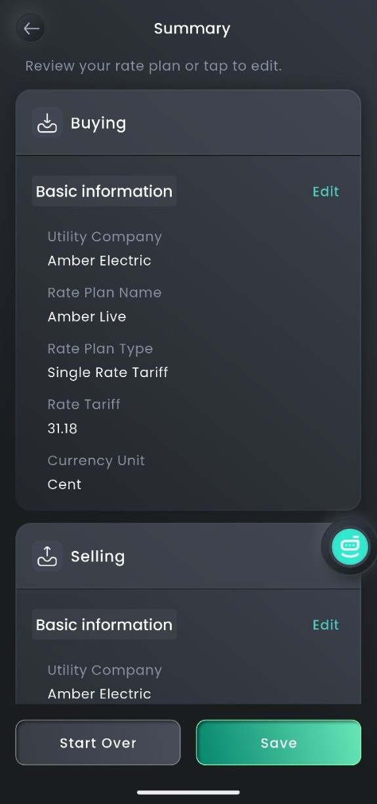

# Amber to Sigen Sync

A Home Assistant custom integration that automatically syncs live 
[Amber Electric](https://www.amber.com.au/) electricity prices to your 
[Sigenergy](https://www.sigenergy.com/) battery system via Sigen Cloud.

## Why?

Amber Electric provides real-time wholesale electricity prices that change 
every 30 minutes. Sigenergy's mySigen app supports dynamic tariffs but does 
not natively integrate with Amber Electric in Australia.

This integration bridges that gap — reading live Amber prices already 
available in Home Assistant and pushing them directly to Sigen Cloud, so your 
battery system always knows the current buy and sell prices without any 
additional Amber API calls.

## How It Works

1. Listens for confirmed (non-estimate) Amber price updates on your existing 
   Home Assistant Amber Electric sensors
2. Reads the current buy and sell prices directly from HA sensor state
3. Authenticates with Sigen Cloud using your credentials
4. POSTs the updated single-rate tariff to Sigen Cloud every time the price 
   changes (approximately every 30 minutes)
5. Your Sigenergy system immediately sees the updated tariff and can optimise 
   accordingly

No additional Amber API calls are made — the integration reuses price data 
already fetched by your existing Amber Electric HA integration.

## Prerequisites

- Home Assistant 2024.1 or later
- [Amber Express](https://github.com/hass-energy/amber-express) custom 
  integration installed and configured
- Sigenergy battery system with cloud access
- A Sigen Cloud account (same credentials as the mySigen app)
- The following values captured from your browser devtools (see below):
  - Sigen encoded password
  - Sigen device ID
  - Sigen station ID

## Installation

### Via HACS (Recommended)

1. Open HACS in Home Assistant
2. Click **Custom Repositories**
3. Add `https://github.com/xitation/amber_sigen_sync` as an **Integration**
4. Search for **Amber to Sigen Sync** and install
5. Restart Home Assistant

### Manual

1. Copy the `custom_components/amber_sigen_sync/` folder to your HA 
   `/config/custom_components/` directory
2. Restart Home Assistant

## Configuration

Go to **Settings → Devices & Services → Add Integration** and search for 
**Amber to Sigen Sync**.

### Required Fields

| Field | Description |
|---|---|
| Sigen username | Your mySigen login email address |
| Sigen encoded password | AES-encoded password captured from browser devtools |
| Sigen device ID | 13-digit `userDeviceId` captured from browser devtools |
| Station ID | Your Sigen controller's numeric station ID |

### Optional Fields

| Field | Default | Description |
|---|---|---|
| General price sensor | `sensor.amber_express_home_general_price_detailed` | Amber import price sensor entity ID |
| Feed-in price sensor | `sensor.amber_express_home_feed_in_price_detailed` | Amber export/FiT price sensor entity ID |
| Plan name | `Amber Live` | Label shown in mySigen app for the tariff plan |

## Getting Your Credentials

### Sigen Encoded Password and Device ID

These are captured from your browser's developer tools:

1. Open **Chrome or Brave** and go to 
   `https://app-aus.sigencloud.com/`
2. Press **F12** to open DevTools → click the **Network** tab
3. Tick **Preserve log** and set filter to **Fetch/XHR**
4. Log in with your normal mySigen credentials
5. Find the POST request to 
   `api-aus.sigencloud.com/auth/oauth/token`
6. Click it → go to the **Payload** tab → click **view source**
7. Copy the `password` value — this is your **Sigen encoded password**
8. Copy the `userDeviceId` value — this is your **Sigen device ID**

> **Important:** The encoded password is not your plain text password. It is 
> an AES-128-CBC encrypted value that the mySigen web portal generates 
> automatically. Copy it exactly as shown in the network request.

### Station ID

The easiest way to find your station ID:

- Open the mySigen app → tap the **SigenAI** chat assistant
- Type: *"Tell me my StationID"*
- It will reply with your numeric station ID

Alternatively, capture it from a HAR:
1. In the same DevTools session, navigate to your tariff/electricity settings
2. Make any change and click **Save**
3. Find the POST to `api-aus.sigencloud.com/device/stationelecsetprice/save`
4. Look for `"stationId"` in the request payload

## Status Sensor

The integration creates a sensor `sensor.amber_sigen_tariff_sync` showing 
the current sync status:

| State | Meaning |
|---|---|
| `never_run` | Integration loaded but sync not yet triggered |
| `ok` | Last sync succeeded |
| `error` | Last sync failed — check `last_error` attribute |

### Sensor Attributes

| Attribute | Description |
|---|---|
| `last_sync` | ISO timestamp of last successful sync |
| `last_error` | Error message from last failed sync |

## Manual Sync

To trigger an immediate sync regardless of price update timing, use the 
**force_sync** action in **Developer Tools → Actions**:
```yaml
action: amber_sigen_sync.force_sync
```

## Verifying It's Working

Once the integration is running and a sync has completed, open the mySigen 
app and navigate to your electricity bill / tariff settings. You should see:

- **Utility Company:** Amber Electric
- **Rate Plan Name:** Amber Live (or your configured plan name)
- **Rate Plan Type:** Single Rate Tariff
- **Rate Tariff:** Current Amber spot price in cents
- **Currency Unit:** Cent



The rate tariff value will update automatically every 30 minutes as Amber 
publishes confirmed prices.

## Troubleshooting

### Sync not triggering automatically

The integration only syncs on **confirmed** prices, not estimates. Amber 
Express holds the previous price until a confirmed price arrives (typically 
within seconds of each 30-minute interval). If you need to test immediately, 
use the `force_sync` action.

### Authentication failing (HTTP 401)

- Verify your encoded password was copied from the **view source** (raw) 
  view in DevTools, not the decoded view
- Ensure `scope=server` is included — it is handled automatically by the 
  integration
- Re-capture the encoded password from DevTools as it may have been 
  truncated during copy

### Price not updating in mySigen

- Check `sensor.amber_sigen_tariff_sync` state and `last_error` attribute
- Run `force_sync` and check **Settings → Logs** filtered by `amber_sigen`
- Verify your station ID is correct

### Integration not appearing after install

Ensure you did a **full restart** of Home Assistant, not just a reload. 
Service registration requires a full restart.

## Technical Notes

- This integration uses an **unofficial, reverse-engineered Sigen Cloud API**. 
  Sigenergy may change their API at any time without notice, which could 
  break this integration.
- The encoded password is stored in your HA config entry. Ensure your HA 
  instance is properly secured.
- Bearer tokens are fetched fresh on every sync and are not stored 
  persistently.
- Prices are synced as a single flat rate (the current spot price), not as a 
  48-slot TOU schedule. The Sigenergy EMS uses this as the reference price 
  for charge/discharge decisions.

## Disclaimer

This integration is not affiliated with, endorsed by, or supported by 
Amber Electric or Sigenergy. Use at your own risk. The developers are not 
responsible for any damages or issues arising from the use of this software.

## Contributing

Issues and pull requests are welcome at 
[github.com/xitation/amber_sigen_sync](https://github.com/xitation/amber_sigen_sync).

## Licence

This project is licensed under the 
[GNU General Public License v3.0](LICENSE).  
Free to use, modify and distribute. Derivative works must also be open source 
under GPL-3.0.
